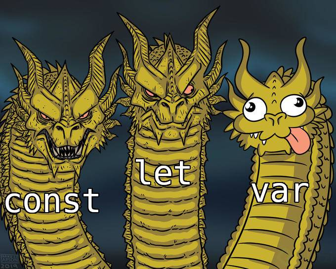

# Scope and Closures in Javascript

## Other Resources

- [Closures by Sacha](https://youtu.be/JXG_gQ0OF74)
- [JavaScript: Closures and the Call Stack](https://medium.com/@akaphenom/javascript-closures-and-the-call-stack-722ef2c3b5a8)
